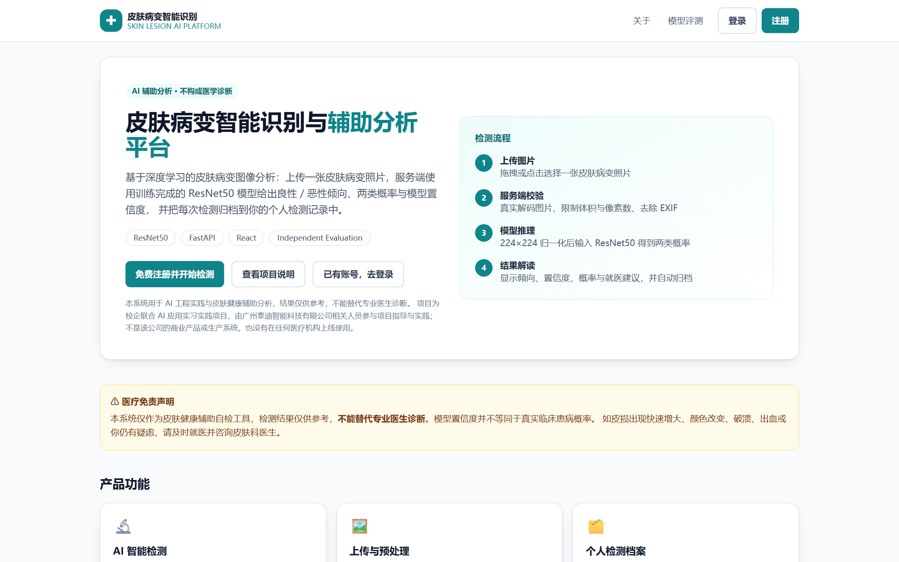
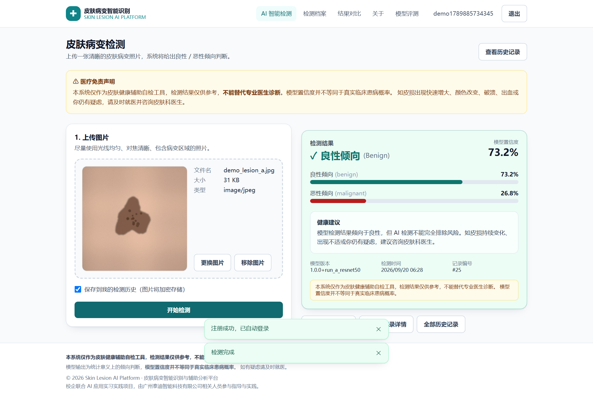
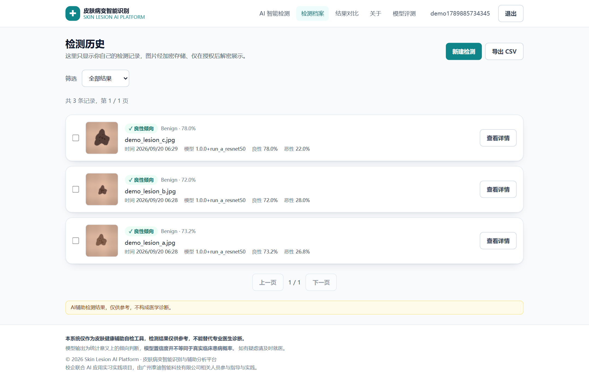
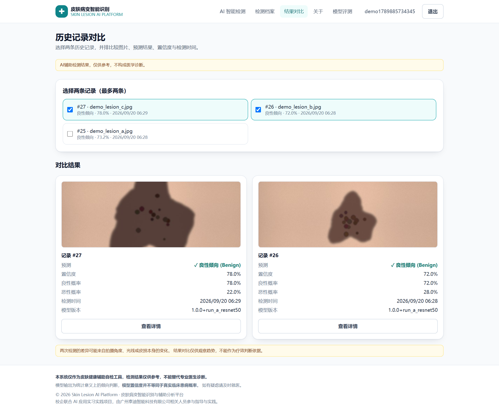
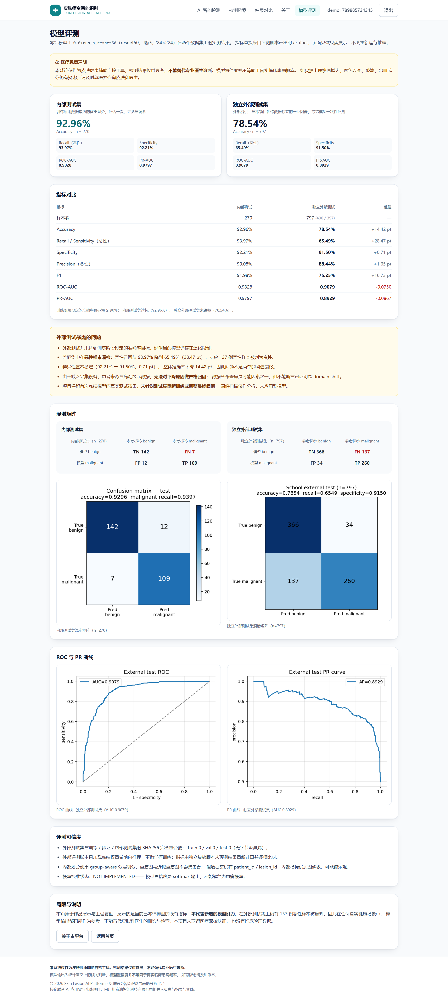
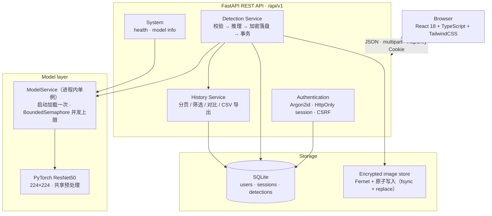

# Skin Lesion AI Platform

**皮肤病变智能识别与辅助分析平台** · 基于 ResNet50、FastAPI 与 React 构建的端到端皮肤病变 AI 应用

[](backend/requirements.txt)
[](ml/train.py)
[](backend/app/main.py)
[](frontend/package.json)
[](frontend/tsconfig.json)
[](LICENSE)

上传一张皮肤病变照片，服务端用训练完成的 ResNet50 模型完成统一预处理与推理，返回
**良性 / 恶性倾向、两类概率、模型置信度与模型版本**，并把记录归档到个人检测档案，
支持历史筛选、两次结果对比与 CSV 导出。
面向的是「发现皮肤异常、想先获得一个倾向性参考并留下可给医生看的记录」的普通使用者。

这条链路是完整的：数据审计与划分 → 模型训练与评估 → 模型服务化 → Web 产品化 →
安全与隐私设计 → 自动化测试 → **独立外部验证**。

**我的角色与范围**：AI 应用开发与产品设计（个人承担需求与验收标准、数据划分方案、模型训练与评估、
后端服务化、前端实现、安全与隐私设计、自动化测试与外部评测）。
开发过程使用 AI Coding Agent 协作，流程与验证方式见
[`docs/engineering/AI_ASSISTED_DEVELOPMENT.md`](docs/engineering/AI_ASSISTED_DEVELOPMENT.md)。

> **这是一个 AI 工程实践项目，不是上线产品。** 项目为校企联合 AI 应用实习实践项目，
> 由广州泰迪智能科技有限公司相关人员参与项目指导与实践；本项目不是该公司的商业产品或生产系统，
> 也没有在任何医疗机构上线使用，没有真实用户与运营数据。

> **医疗免责声明**：本项目用于 AI 工程实践与皮肤健康辅助分析，模型输出**不能替代专业医生诊断**，
> 置信度也不等同于真实临床患病概率。独立外部测试中有 **137 例恶性样本被漏判**，详见
> [独立外部验证](#independent-external-validation)。

---

## Demo

以下截图全部来自**真实运行的系统**（Playwright 采集，1440×900 @1.5x）：
真实注册登录、真实上传、真实模型推理，没有设计稿、没有假数据、没有伪造预测。



| AI 智能检测 · 真实推理结果 | 个人检测档案 |
| --- | --- |
|  |  |

| 历史结果对比 | 模型评测（内外部真实指标） |
| --- | --- |
|  |  |

> **输入图片说明**：截图中的输入图像由 [`scripts/make_demo_images.py`](scripts/make_demo_images.py)
> 程序化生成的**合成示意图**（非医学图像、非真实病例），用于避免公开第三方病变照片带来的版权与隐私问题。
> 界面上显示的倾向、概率、模型版本与记录编号全部来自真实模型的真实推理；
> 完整 13 张截图与逐次检测记录见 [`docs/assets/screenshots/`](docs/assets/screenshots/) 与
> `screenshots.json`。仓库**不包含**数据集与模型权重，原因见 [数据集与模型权重](#dataset--model-weights)。

## Internship Context

本项目为校企联合 AI 应用实习实践项目，广州泰迪智能科技有限公司相关人员参与项目指导与实践。
项目定位是 **AI 应用工程的完整实践**：从需求与验收标准出发，把模型能力真正落成一个有权限、
有历史、有安全设计的 Web 应用，并用独立数据检验它真实的泛化水平。

## Highlights

- **端到端交付**：数据审计 → 训练 → 评估 → 服务化 → Web 产品 → 安全 → 测试 → 独立外部验证，全部可运行、可复现。
- **诚实的外部验证**：内部测试集 92.96%，独立外部测试集 **78.54%**——差距被完整保留并分析，未针对测试集重训或调阈值。
- **反泄漏的数据划分**：完全重复（SHA256）与近似重复（dHash ≤ 2）聚类成组，整组进同一划分，并断言三重交集为 0。
- **训练/服务共用一套预处理**：服务端与评估脚本调用同一个 transform，均值方差从 checkpoint 读回，杜绝训练-服务漂移。
- **隐私优先的图像处理**：图片真实解码 → 剥离 EXIF → Fernet 加密落盘 → 仅本人授权后解密，文件名由服务端生成。
- **完整的工程闭环**：pytest 106 项 + Vitest 37 项 + Playwright 5 用例 × 4 浏览器 + 真实模型冒烟测试。

## Architecture



分层与并发/失败处理细节见 [`docs/engineering/ARCHITECTURE.md`](docs/engineering/ARCHITECTURE.md)，
数据模型见 [`docs/engineering/DATABASE.md`](docs/engineering/DATABASE.md)，
接口契约见 [`docs/engineering/API.md`](docs/engineering/API.md)。

## Product Features

| 模块 | 能力 |
| --- | --- |
| AI 智能检测 | 拖拽/点击上传（JPG/PNG/WEBP/BMP）、上传前预览、服务端真实解码校验、224×224 统一预处理、ResNet50 推理、倾向/置信度/两类概率/模型版本/检测时间 |
| 个人检测档案 | 每次检测自动归档、分页浏览、按良性/恶性倾向筛选、详情页（含授权后解密的历史图片） |
| 历史结果分析 | 逐条概率分布、健康提示、模型置信度与免责声明常驻 |
| 结果对比 | 任意两条记录并排对比倾向、置信度与概率差异 |
| 检测数据导出 | 按筛选条件导出 CSV（含公式注入防护） |
| 用户与隐私管理 | 注册/登录/退出、资料修改、账号删除（级联清除加密图片） |
| 模型与系统状态 | 健康检查、模型元数据、评测页只读展示内外部真实指标 |

## Model & Evaluation

模型：`resnet50`（ImageNet 预训练 + 两阶段迁移学习：先冻结 backbone 训练分类头，再整体微调），
输入 224×224，输出 `benign=0 / malignant=1`。版本 `1.0.0+run_a_resnet50`，训练 12 个 epoch
（最佳第 7 轮），验证集选模型 + 早停（patience=5），混合精度 + 类别权重。

| 数据集 | 样本数 | Accuracy | Recall（恶性） | Specificity | ROC-AUC |
| --- | ---: | ---: | ---: | ---: | ---: |
| 内部测试集（留出划分，只评估一次） | 270 | 92.96% | 93.97% | 92.21% | 0.9828 |
| **独立外部测试集** | **797** | **78.54%** | **65.49%** | 91.50% | 0.9079 |

内部测试集：Precision 90.08% · F1 91.98% · PR-AUC 0.9797 · 混淆矩阵 TP=109 / TN=142 / FP=12 / FN=7。
外部测试集：Precision 88.44% · F1 75.25% · PR-AUC 0.8929 · 混淆矩阵 TP=260 / TN=366 / FP=34 / **FN=137**。

**外部测试并未达到训练阶段设定的 ≥90% 准确率目标，这说明当前模型仍存在泛化限制。**
差距集中在恶性样本召回：Recall 从 93.97% 掉到 65.49%（−28.47 pt），而 Specificity 几乎不变
（92.21% → 91.50%），整体准确率下降 14.42 pt。由于缺乏采集设备、患者来源与病灶级元数据，
**无法对下降原因做严格归因**，数据分布差异是可能因素之一，但不能断言已证明是 domain shift。

> 这些数字由评测脚本从 artifact 直接产生，并做两层校验：独立复核脚本从预测结果重算全部指标
> （7/7 PASS），前端评测页的静态数值另有 `scripts/check_metrics_consistency.py` 与 artifact 逐字段比对。

## Independent External Validation

外部测试数据由项目外提供（797 张，benign 400 / malignant 397，全部 224×224），
使用**冻结的** `best_model.pt` 一次性评测，评测前后未做任何训练、微调或阈值调整：

- 外部数据与训练/验证/内部测试集的 **SHA256 完全重合数 = 0 / 0 / 0**（无字节级泄漏）；
- 外部评测脚本只加载权重做前向推理（`no_grad`），模块内没有任何优化器或反向传播；
- 指标由 `scripts/verify_external_test.py` 从 `external_predictions.csv` 独立重算并逐项比对，
  结果 `verdict: PASS`，同时输出 171 条错误样本清单（FN 137 / FP 34）；
- 阈值扫描仅作分析（阈值降到 0.3 时外部准确率也只有 80.93%），**未应用到模型**；
- `models/best_model.pt` 在评测前后 SHA256 一致：
  `9c385625fba8d297fdfc2808c3504d034eadfcfdfa3182e844d604e4c2d164e8`。

完整报告：[`docs/ml/EXTERNAL_EVALUATION.md`](docs/ml/EXTERNAL_EVALUATION.md)（含逐项指标来源）；
项目来源材料（需求文件、交付报告、原始专项文档）按原样保留在
[`docs/archive/`](docs/archive/)，其公开范围见
[`private-release-exclusions.md`](private-release-exclusions.md)。

**这个模型能不能当筛查工具用？在这个工作点上不能。** 外部评测集是类别均衡的（400 / 397），
而真实人群的患病率远低于此：按实测的敏感度 65.49% 与特异度 91.50% 换算，
患病率降到 1% 时 PPV 只有约 7.2%（1000 人里约 84 次误报对应 3.5 例漏检），
患病率 5% 时 PPV 约 28.9%。也就是说它只能作为「补充参考信号」，
**不能作为独立筛查或排除手段**。换算脚本见 [`scripts/prevalence_analysis.py`](scripts/prevalence_analysis.py)。

## Engineering Highlights

**ML Engineering**

- 数据审计：损坏图检测、完全重复分组（SHA256）、近似重复分组（dHash 距离 ≤ 2）、跨类别重复检查
- Group-aware 分层划分：重复/近似重复图整组进同一划分，事后断言语义三重交集（SHA256 / 组 / 类内文件名）为 0
- 两阶段迁移学习、类别权重、增强管线、混合精度、验证集选模型、早停
- 训练即产出可复现元数据：版本、种子、超参数、环境（Python / torch / CUDA / GPU）
- 内部一次性评估 + 独立外部评估 + 错误样本分析（FN/FP 分类清单）

**AI Serving**

- FastAPI 服务化，`ModelService` 进程内单例：启动加载一次，避免每请求重载权重
- 训练 / 评估 / 服务共用同一份预处理实现，均值方差从 checkpoint 读回，杜绝口径漂移
- `BoundedSemaphore` 限制并发推理 + 30s 获取超时，超时返回可读错误而非拖垮服务；阻塞前向经线程池执行，不占用事件循环
- 模型版本随每条检测记录落库并回传前端；健康检查同时反映数据库与模型状态

**Full-stack**

- React 18 + TypeScript + TailwindCSS SPA，受保护路由与登录态恢复
- 拖拽上传 + 客户端预校验 + 服务端二次真实解码；幂等上传（`Idempotency-Key`）
- 结果可视化（倾向 / 置信度 / 两类概率条 / 无障碍 `role="progressbar"`）
- 历史分页与筛选、详情、双记录对比、CSV 导出、账号资料与删除

**Security & Privacy**

- Argon2id 口令哈希；会话令牌只存哈希，HttpOnly Cookie 承载（`SameSite`/`Secure` 可配置）
- 所有状态变更接口 CSRF 双重提交校验；越权访问按「不存在」处理（恒定 404），不泄露 ID 是否存在
- 上传图片真实解码 → 剥离 EXIF/元数据 → Fernet 加密落盘（服务端生成文件名、原子写入）
- 体积、像素数与单边尺寸上限，Pillow 全局像素上限；路径穿越三层校验；日志脱敏（密钥/令牌/口令/base64）
- 登录尝试限流（滑动窗口）；推理并发上限

**Quality**

- pytest 后端 106 项（认证 / 检测 / 安全 / ML 管道）、Vitest 前端 37 项、Playwright 5 用例 × 4 浏览器
- 真实模型冒烟测试：走真实 HTTP 上传，比对 API 与本地前向的概率差 < 1e-4、校验模型版本与免责声明，输出 JSON 报告
- 文档与数值一致性脚本：指标-文档交叉校验、前端静态指标-vs-artifact 校验、全仓相对链接校验

## Security & Privacy

| 关注点 | 实现 |
| --- | --- |
| 口令 | Argon2id（time=3 / memory=64MiB / parallelism=2），登录失败路径也执行恒定工作量比对 |
| 会话 | 随机令牌，数据库只存 SHA-256 哈希；HttpOnly Cookie；`COOKIE_SECURE` / `COOKIE_SAMESITE` 可配置 |
| CSRF | 非 HttpOnly 的 `csrf_token` + `X-CSRF-Token` 双重提交，上传/删除/改资料/删账号全部强制 |
| 越权 | 所有读取、解密、删除查询都带 `user_id` 过滤，越权命中返回 404，不区分「存在但无权」 |
| 图像 | Fernet 对称加密落盘，密钥仅由 `IMAGE_ENCRYPTION_KEY` 注入（生产缺失则拒绝启动），文件名服务端生成 |
| 元数据 | 上传后重新绘制像素并清空 `info`，剥离 EXIF/ICC/文本块 |
| 上传防护 | 真实解码校验、后缀与格式白名单、体积上限、像素上限、单边尺寸上限、路径穿越拦截 |
| 日志 | 口令 / 会话密钥 / 加密密钥 / Authorization / Cookie / 长 base64 全部脱敏 |

已知边界：限流只覆盖登录尝试（注册与推理端点无配额）；`COOKIE_SECURE` 默认关闭，生产需显式开启；
SQLite 为单实例部署，多实例与高并发写入未验证。

## AI-assisted Development

本项目把 AI Coding Agent 纳入了工程流程，而不是让 Agent 代替工程判断：由人定义目标、非目标与验收标准，
把架构约束、安全要求、并发与失败处理、测试要求整理成结构化提示词交给 Agent 执行，
Agent 的产出再经过代码审查、自动化测试与真实运行验证才被接受。
这里的「评审」指**同一次 Agent 运行内按独立角色执行的评审 pass**（评审提示词见
[`docs/prompts/REVIEW_PROMPT.md`](docs/prompts/REVIEW_PROMPT.md)），不是第三方人工评审；
它确实发现并修掉了真实缺陷（上传接口缺失 CSRF 强制、加载失败泄露模型路径），
评测数字也是回到 artifact 逐项复核后才发现并纠正了文档口径。

完整方法与边界见 [`docs/engineering/AI_ASSISTED_DEVELOPMENT.md`](docs/engineering/AI_ASSISTED_DEVELOPMENT.md)。

## Tech Stack

| 层 | 技术 |
| --- | --- |
| 深度学习 | PyTorch 2.5.1、torchvision、ResNet50、迁移学习、AMP、class weights、早停 |
| 后端 | Python 3.10、FastAPI 0.115、Pydantic 2、SQLAlchemy 2、SQLite、cryptography(Fernet)、argon2-cffi |
| 前端 | React 18、TypeScript 5、TailwindCSS 3、React Router 6、Vite 5 |
| 测试 | pytest、Vitest + Testing Library、Playwright |
| 部署 | Docker Compose、nginx、uvicorn（Windows 一键启动脚本另附） |

## Quick Start

### Windows 一键启动

| 双击 | 作用 |
| --- | --- |
| `SETUP.bat` | 首次使用：检查 Python/Node → 创建 `.venv` → 安装后端依赖 → `npm ci` → 由 `.env.example` 生成 `backend\.env` 并写入随机密钥 |
| `START.bat` | 启动后端与前端，轮询健康检查直到模型加载完成，然后打开浏览器 |
| `STATUS.bat` / `STOP.bat` | 查看状态 / 只关闭本项目启动的进程树 |

启动器不安装系统软件、不需要管理员权限、支持含空格与中文的路径，重复启动不会起第二套服务。
面向非开发者的说明见 [`launcher/README.md`](launcher/README.md)。

### 手动启动

```powershell
# 1) 依赖
python -m venv .venv
.\.venv\Scripts\Activate.ps1
pip install -r backend\requirements.txt
# 无 GPU 时（体积小）
pip install torch==2.5.1 torchvision==0.20.1 --index-url https://download.pytorch.org/whl/cpu
cd frontend; npm install; cd ..

# 2) 密钥（生成到项目根的 .env；也可让 SETUP.bat 自动完成）
Copy-Item .env.example .env
.\.venv\Scripts\python.exe scripts\generate_secrets.py >> .env

# 3) 后端（终端 1）
cd backend
..\.venv\Scripts\python.exe -m uvicorn app.main:app --host 127.0.0.1 --port 8000 --reload

# 4) 前端（终端 2）
cd frontend
npm run dev
```

访问 <http://127.0.0.1:5173>；交互式 API 文档 <http://127.0.0.1:8000/docs>；
健康检查 <http://127.0.0.1:8000/api/v1/health>。

模型权重不放仓库，需要先按下面「数据集与模型权重」一节训练一次，或在首次 `SETUP.bat` 后放入
`models/best_model.pt`；缺少权重时后端会以模型不可用状态启动，健康检查会如实反映。

### Docker

`docker-compose.yml` 与 `frontend/nginx.conf` 已提供且配置语法校验通过
（`docker compose config` exit 0），但**本机 Docker daemon 未运行，镜像构建与容器运行未实测
（NOT TESTED）**。演示请优先使用 Windows 一键启动或手动启动。

## Dataset & Model Weights

仓库**不包含**训练数据集、外部测试图片与模型权重文件：

- `models/*.pt` 被 `.gitignore` 排除（ResNet50 权重 94 MB，需由训练脚本重新生成）；
- `data/raw/`、`数据/` 与外部测试数据均未提交，只保留 `data/manifests/*.csv` 划分清单
  （含 `sha256` / `phash` / `group` 列，用于复现反泄漏划分）与 `data/manifests/split_summary.json`；
- 数据集与图片的再分发授权未确认，因此公开仓库只保留**统计结果、划分清单与评测 artifact**；
- README 截图使用的输入图像是 `docs/assets/demo/` 下程序化生成的合成示意图，不是真实病例图片。

复现训练（需要自备数据集，`benign/` 与 `malignant/` 两个目录）：

```powershell
# 数据审计 + 划分（输出 docs/ml/DATASET_REPORT.md、data/manifests/*.csv）
.\.venv\Scripts\python.exe -m ml.prepare_data

# 训练（两阶段迁移学习，验证集选模型 + 早停）
.\.venv\Scripts\python.exe -m ml.train --model resnet50 --epochs 18 --batch-size 32

# 内部测试集一次性评估（不参与调参）
.\.venv\Scripts\python.exe -m ml.evaluate --model models\best_model.pt --split test
```

产物：`models/best_model.pt`、`models/model_meta.json`、`models/class_mapping.json`、
`artifacts/metrics.json` 与混淆矩阵/ROC/PR/训练曲线图。

外部评测（有标签或无标签图片目录均可）：

```powershell
.\.venv\Scripts\python.exe -X utf8 -m ml.evaluate_external --input <图片目录> --output artifacts\external_test
.\.venv\Scripts\python.exe -X utf8 scripts\verify_external_test.py   # 独立重算并复核
```

操作手册见 [`docs/testing/EXTERNAL_TEST_RUNBOOK.md`](docs/testing/EXTERNAL_TEST_RUNBOOK.md)。

## Testing

```powershell
# 后端
cd backend; ..\.venv\Scripts\python.exe -m pytest -q          # 106 passed

# 前端单元测试 / 类型检查 / 构建 / 静态检查
cd frontend; npm test; npm run typecheck; npm run build; npm run lint
# 37 passed · 0 type errors · build ok · lint 0 problems

# 端到端（需先手动启动后端；本命令会自行启动 4173 端口的预览服务器并把 /api 代理到后端）
cd frontend; npx playwright install chromium firefox webkit
npm run e2e                                                   # 5 用例 × 4 浏览器 = 20 次执行

# 真实模型冒烟（需后端运行）
.\.venv\Scripts\python.exe scripts\smoke_real_model.py --samples 12

# 重新采集 README 截图（需后端 + 前端预览运行；图片为合成示意图）
.\.venv\Scripts\python.exe -X utf8 scripts\make_demo_images.py
node scripts\capture_screenshots.mjs --base-url http://localhost:4173

# 一致性检查
.\.venv\Scripts\python.exe -X utf8 scripts\check_metrics_consistency.py   # 前端指标 vs artifact
.\.venv\Scripts\python.exe -X utf8 scripts\check_links.py                 # 全仓相对链接
.\.venv\Scripts\python.exe -X utf8 scripts\check_final_numbers.py         # 文档数字一致性

# 成品检查：用真实无头浏览器核对品牌、医疗措辞与评测页内容（需后端 + 前端预览运行）
node scripts\presentation_check.mjs --base-url http://localhost:4173      # 18 项检查
```

实测记录与未测试项（Docker 运行、真实 HTTPS 下的 Cookie、>10 并发压测、真机 Safari/Edge 人工验证）
见 [`docs/testing/TEST_REPORT.md`](docs/testing/TEST_REPORT.md)。

> 仓库**没有**托管 CI（无 GitHub Actions 等配置），上表中的数字全部来自本地实测，因此不发布 CI badge；
> 可复现的命令与逐项结果见 [`docs/testing/TEST_REPORT.md`](docs/testing/TEST_REPORT.md)
> 与 `artifacts/real_model_smoke.json`。

## Project Structure

```
.
├─ backend/            FastAPI 服务（api / core / db / ml / services / schemas + pytest）
├─ frontend/           React 18 + TS 客户端（pages / components / hooks / test + Playwright）
├─ ml/                 数据审计与划分 / 训练 / 评估 / 外部评测 / 推理 / 优化
├─ models/             模型元数据与类别映射（权重 *.pt 不入库，由训练生成）
├─ artifacts/          真实指标 JSON、混淆矩阵、ROC/PR 曲线、训练曲线、错误样本清单
├─ data/manifests/     划分清单（sha256 / phash / group，用于复现反泄漏划分）
├─ docs/               product / engineering / ml / testing / deployment / career + archive
├─ scripts/            一键启动器、截图采集、冒烟测试与各一致性检查脚本
├─ launcher/           面向非开发者的一键启动说明
└─ START.bat SETUP.bat STATUS.bat STOP.bat
```

## Documentation

| 文档 | 内容 |
| --- | --- |
| [`docs/product/PRD.md`](docs/product/PRD.md) | 需求、功能与非功能需求、验收条件 |
| [`docs/product/UI_UX.md`](docs/product/UI_UX.md) | 页面、流程、组件、响应式与无障碍 |
| [`docs/engineering/ARCHITECTURE.md`](docs/engineering/ARCHITECTURE.md) | 架构分层、时序、并发与安全设计 |
| [`docs/engineering/API.md`](docs/engineering/API.md) | 全部接口与错误契约 |
| [`docs/engineering/DATABASE.md`](docs/engineering/DATABASE.md) | ER 图、表结构、索引、事务 |
| [`docs/engineering/AI_ASSISTED_DEVELOPMENT.md`](docs/engineering/AI_ASSISTED_DEVELOPMENT.md) | AI 辅助开发的流程、验证与边界 |
| [`docs/engineering/PRIVACY_AND_IP_AUDIT.md`](docs/engineering/PRIVACY_AND_IP_AUDIT.md) | 公开前的隐私与知识产权审计记录 |
| [`docs/ml/DATASET_REPORT.md`](docs/ml/DATASET_REPORT.md) | 数据集审计（自动生成） |
| [`docs/ml/MODEL_REPORT.md`](docs/ml/MODEL_REPORT.md) | 数据、划分、训练、指标、性能与局限 |
| [`docs/ml/EXTERNAL_EVALUATION.md`](docs/ml/EXTERNAL_EVALUATION.md) | 独立外部验证的完整结果与归因边界 |
| [`docs/testing/TEST_REPORT.md`](docs/testing/TEST_REPORT.md) | 测试命令、数量、结果与未测试项 |
| [`docs/deployment/DEPLOYMENT.md`](docs/deployment/DEPLOYMENT.md) | 本地 / Docker / 生产部署 |
| [`docs/deployment/OPERATIONS.md`](docs/deployment/OPERATIONS.md) | 模型替换、备份、日志、故障排查 |
| [`docs/career/CASE_STUDY.md`](docs/career/CASE_STUDY.md) | 工程复盘：从内部 92.96% 到外部 78.54% |
| [`docs/career/RESUME_PROJECT.md`](docs/career/RESUME_PROJECT.md) | 项目简历文案（AI 产品 / FDE / AI 工程三个方向） |
| [`docs/career/INTERVIEW_NOTES.md`](docs/career/INTERVIEW_NOTES.md) | 面试问答口径与真实边界 |
| `docs/archive/project-origin/`（公开快照中不包含） | 项目来源材料归档（需求文件、交付报告、原始专项文档） |

## Limitations

1. 数据集仅 1840 张（benign 1040 / malignant 800），远小于公开皮肤病数据集，泛化能力有限。
2. 数据没有 `patient_id` / `lesion_id`，划分只能是图像级分组划分，**内部指标偏乐观**。
3. **独立外部测试准确率 78.54%、恶性召回 65.49%**，未达训练阶段 90% 目标；外测数据与内部数据来源不同，
   缺乏元数据因此无法严格归因。
4. **未做概率校准**（`calibration: NOT IMPLEMENTED`），置信度不能解释为患病概率。
5. 训练/评估/服务使用 224×224 输入，真实拍摄条件的分布差异未做鲁棒性实验。
6. SQLite 单实例部署，多实例与高并发写入未验证；限流只覆盖登录尝试，推理端点只有并发上限。
7. 模型压缩只做了 TorchScript 导出与动态量化基准（结论：体积几乎不变，生产使用 FP32），**剪枝未做**。
8. Docker 构建与运行未实测；真实 HTTPS 下的 Cookie 行为未验证；未做 >10 并发压测。
9. 未实现邮箱验证、找回密码、双因素认证与 Grad-CAM 可解释性；没有用户反馈采集机制。
10. **没有任何临床验证与医疗器械认证**，本项目不是医疗设备。

## Medical Disclaimer

本项目用于 AI 工程实践与皮肤健康辅助分析。模型输出是统计意义上的倾向判断，
**不能替代专业医生诊断**，不能作为任何医疗场景的决策依据。外部测试中 137 例恶性样本被漏判，
说明漏检风险真实存在：如皮损出现快速增大、颜色改变、破溃、出血，或你仍有疑虑，请及时就医。

## License & Usage

代码与文档采用 **MIT License**（见 [`LICENSE`](LICENSE)），可自由使用、修改与再分发。
授权范围与不覆盖的内容（数据集、模型权重、派生图片）见 [`NOTICE.md`](NOTICE.md)。

> **授权范围**：MIT 只覆盖本仓库中的代码与文档，**不包含**训练/评测数据集、模型权重，
> 也不包含由这些数据派生的图像（它们都未包含在本仓库中，说明见
> [数据集与模型权重](#dataset--model-weights)）。项目展示的截图使用程序化生成的合成示意图，
> 因此不涉及第三方图片权利。

项目来源材料（需求文件、交付报告等）按原样归档在 `docs/archive/project-origin/`，
其公开权限尚未确认；因此**公开仓库不包含**这些材料
（排除范围见 [`private-release-exclusions.md`](private-release-exclusions.md)）。
