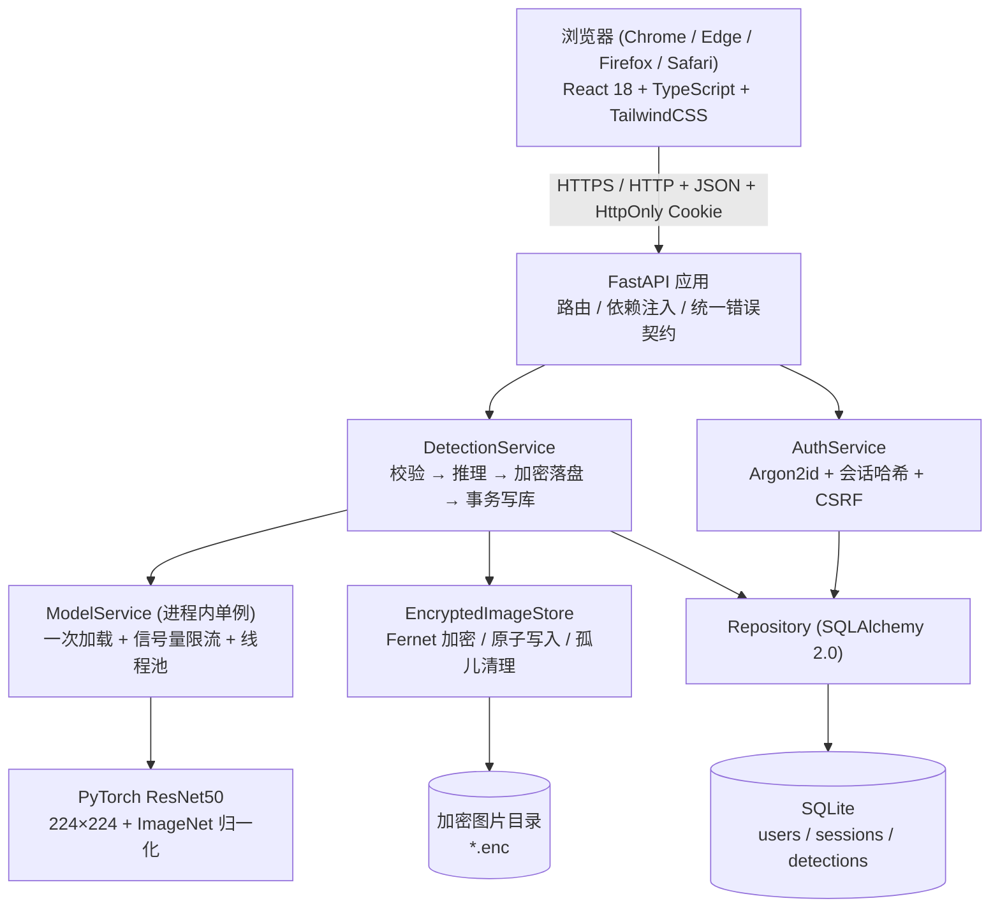
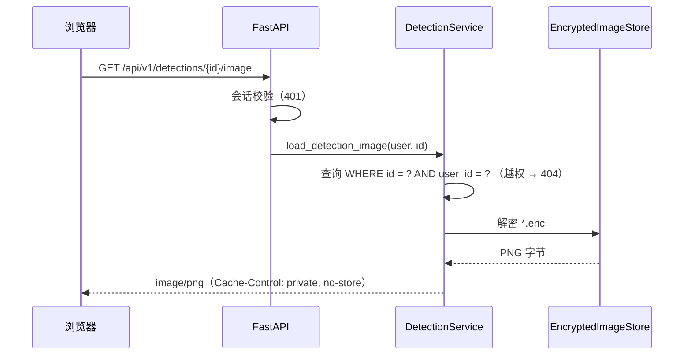
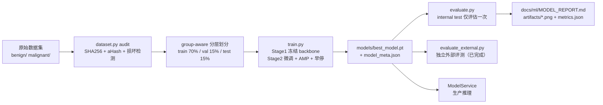
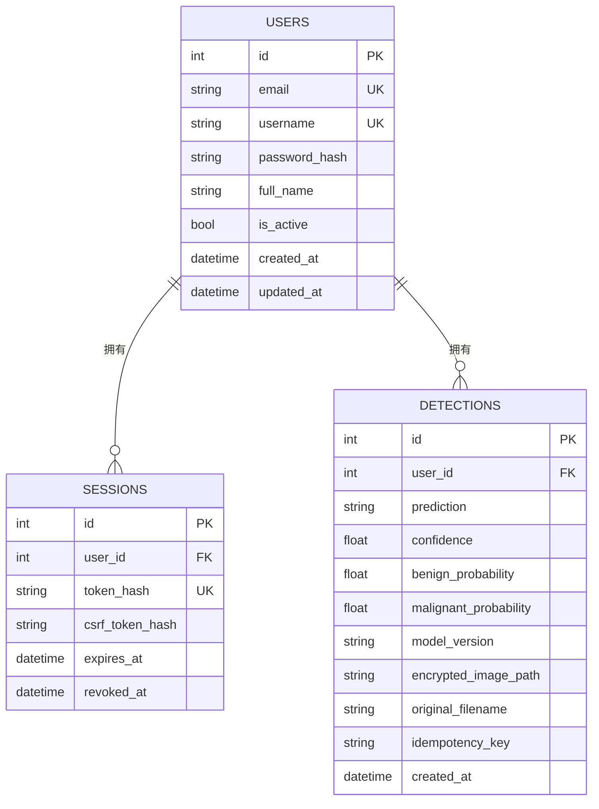
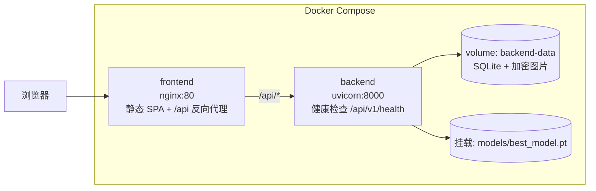

# 系统架构设计 (ARCHITECTURE)

- 文档版本：1.0.0
- 相关文档：[PRD](../product/PRD.md) · [DATABASE](DATABASE.md) · [API](API.md) · [MODEL_REPORT](../ml/MODEL_REPORT.md)

---

## 1. 总体架构

采用前后端分离的 B/S 架构：浏览器（React SPA）↔ HTTP/JSON + Cookie 会话 ↔ FastAPI 服务 ↔
服务层 ↔ 仓储层（SQLAlchemy）↔ SQLite / 加密文件存储；ML 路径独立为
`DetectionService → ModelService → PyTorch ResNet`。



## 2. 分层职责

| 层 | 目录 | 职责 | 不允许做 |
| --- | --- | --- | --- |
| API 层 | `backend/app/api/` | 路由、请求校验、依赖注入、状态码 | 业务逻辑、SQL |
| 服务层 | `backend/app/services/` | 业务编排、事务边界、文件与数据库一致性 | 直接操作 HTTP 对象 |
| 仓储/模型层 | `backend/app/db/` | ORM 模型、会话、索引与约束 | 业务规则 |
| ML 服务层 | `backend/app/ml/` | 模型加载、并发控制、推理 | 直接读写数据库 |
| ML 管道 | `ml/` | 数据审计、划分、训练、评估、导出 | 依赖 Web 框架 |
| 前端 | `frontend/src/` | 展示、交互、客户端预校验、API 调用 | 自行计算预测结果 |

关键原则：**前端不决定预测结果**，所有类别映射来自 `models/class_mapping.json` 与
`GET /api/v1/model/info`。

## 3. 关键流程

### 3.1 检测请求（含失败回滚）

```mermaid
sequenceDiagram
    participant U as 浏览器
    participant API as FastAPI
    participant SVC as DetectionService
    participant MS as ModelService
    participant ST as EncryptedImageStore
    participant DB as SQLite

    U->>API: POST /api/v1/detections (multipart, Idempotency-Key)
    API->>API: 会话校验 + 大小预检
    API->>SVC: 已解码的 RGB 图像
    SVC->>DB: 查 (user_id, idempotency_key)
    alt 命中已有记录
        DB-->>SVC: 已有记录
        SVC-->>U: 返回原记录 (created=false)
    else 新请求
        SVC->>MS: predict(image)
        MS->>MS: 信号量 + 线程池 + 前向推理
        MS-->>SVC: 概率 / 版本 / 延迟
        SVC->>ST: 加密写入临时文件 → 原子 rename
        SVC->>DB: INSERT detection; COMMIT
        alt COMMIT 失败
            SVC->>ST: 删除刚写入的密文（避免孤儿文件）
            SVC-->>U: 500 STORAGE_ERROR / INTERNAL_ERROR
        else 成功
            SVC-->>U: 201 结果 JSON
        end
    end
```

### 3.2 历史图片读取



### 3.3 训练与评估流程



## 4. 数据模型（摘要）



完整字段、索引与约束见 [DATABASE.md](DATABASE.md)。

## 5. 并发与性能

| 关注点 | 方案 |
| --- | --- |
| 模型加载 | `ModelService` 进程内单例，启动时加载一次（`MODEL_WARMUP=true`），绝不每次请求加载 |
| 阻塞推理 | `anyio.to_thread.run_sync` 把 PyTorch 前向放到线程池，不阻塞事件循环 |
| 并发上限 | `threading.BoundedSemaphore(INFERENCE_CONCURRENCY)`，默认 2，防止 CPU 饱和 / GPU OOM |
| 数据库 | SQLite + WAL + `foreign_keys=ON`；连接 `check_same_thread=False` |
| 大文件 | 读取上限 `MAX_UPLOAD_MB + 1` 字节，超限立即 413；像素数上限 `MAX_IMAGE_PIXELS` |
| 幂等 | `UNIQUE(user_id, idempotency_key)` 数据库约束 + IntegrityError 回查 |

实测数据（模型大小、加载时间、单张推理延迟、API 端到端延迟）见
[docs/ml/MODEL_REPORT.md](../ml/MODEL_REPORT.md) 的"性能"章节与 `artifacts/optimization_report.json`。

## 6. 安全设计要点

| 威胁 | 对策 |
| --- | --- |
| 密码泄露 | Argon2id（64 MiB / 3 轮 / 2 并行），从不记录明文 |
| 会话窃取 | 256-bit 随机 token，DB 只存 SHA-256 哈希；HttpOnly + SameSite=Lax；生产 `Secure` |
| CSRF | 双提交令牌，绑定会话行，所有写操作强制校验 |
| IDOR | 所有查询强制 `WHERE user_id = 当前用户`；越权统一返回 404 |
| 文件伪装 | Pillow 真实解码 + `verify()`，不信任扩展名/MIME |
| 解压炸弹 | `MAX_IMAGE_PIXELS` + 单边尺寸上限 |
| 路径穿越 | 服务端生成 `uuid4().enc` 文件名，`_resolve()` 二次校验父目录 |
| 敏感图片泄露 | 落盘 Fernet 加密；不提供静态目录；读取需授权后解密 |
| 敏感日志 | `RedactingFilter` 过滤密码/令牌/密钥/base64 大块数据 |
| SQL 注入 | 全程 SQLAlchemy 参数化查询 |
| XSS | React 默认转义；不使用 `dangerouslySetInnerHTML` |
| 信息泄露 | 统一错误契约，不返回 traceback / 路径 / SQL / 密钥 |

## 7. 部署形态



详见 [DEPLOYMENT.md](../deployment/DEPLOYMENT.md) 与仓库根目录 `docker-compose.yml`。

## 8. 目录结构

```
fianl/
├─ backend/                 FastAPI 服务
│  ├─ app/
│  │  ├─ api/               路由 + 依赖注入
│  │  ├─ core/              配置 / 日志脱敏 / 安全 / 错误契约
│  │  ├─ db/                SQLAlchemy 模型与会话
│  │  ├─ ml/                模型服务（单例 + 限流）
│  │  ├─ schemas/           Pydantic 请求/响应模型
│  │  ├─ services/          认证 / 用户 / 检测 / 加密存储
│  │  └─ main.py            应用工厂
│  └─ tests/                pytest 测试
├─ frontend/                React 18 + TS + Tailwind
│  ├─ src/{api,components,hooks,pages,types,utils,test}
│  └─ tests/e2e/            Playwright
├─ ml/                      数据审计 / 训练 / 评估 / 推理
├─ models/                  模型产物（best_model.pt 等）
├─ data/{raw,manifests,external_test}
├─ artifacts/               图表与指标 JSON
├─ docs/                    全部文档 + prompts/
├─ skills/                  可复用 Skill
└─ docker-compose.yml
```
