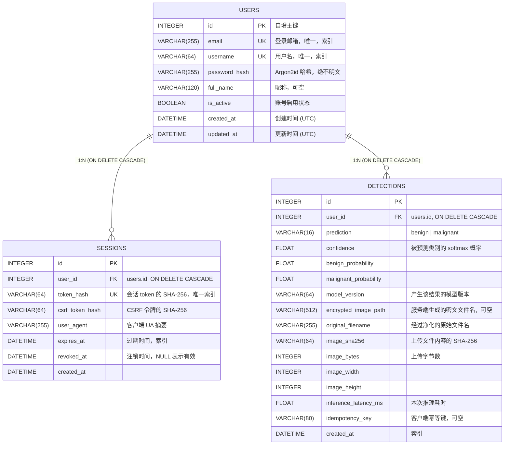

# 数据库设计 (DATABASE)

- 数据库：SQLite 3（`sqlite3` 驱动，通过 SQLAlchemy 2.0 ORM 访问）
- 默认位置：`backend/data/app.sqlite3`（可通过 `DATABASE_URL` 覆盖，已被 `.gitignore` 忽略）
- 连接设置：`PRAGMA foreign_keys=ON`、`journal_mode=WAL`、`synchronous=NORMAL`、`check_same_thread=False`

---

## 1. ER 图



## 2. 表结构明细

### 2.1 users

| 列 | 类型 | 约束 | 说明 |
| --- | --- | --- | --- |
| id | INTEGER | PK, autoincrement | 主键 |
| email | VARCHAR(255) | UNIQUE, NOT NULL, INDEX | 统一转小写存储 |
| username | VARCHAR(64) | UNIQUE, NOT NULL, INDEX | 3–64 字符，`[A-Za-z0-9._-]` |
| password_hash | VARCHAR(255) | NOT NULL | Argon2id（time_cost=3, memory_cost=64MiB, parallelism=2） |
| full_name | VARCHAR(120) | NULL | 昵称 |
| is_active | BOOLEAN | NOT NULL, default true | 停用后无法登录 |
| created_at | DATETIME(tz) | NOT NULL | UTC |
| updated_at | DATETIME(tz) | NOT NULL | 更新时自动刷新 |

### 2.2 sessions

| 列 | 类型 | 约束 | 说明 |
| --- | --- | --- | --- |
| id | INTEGER | PK | |
| user_id | INTEGER | FK → users.id ON DELETE CASCADE, INDEX | |
| token_hash | VARCHAR(64) | UNIQUE, NOT NULL, INDEX | 仅存哈希，明文只存在于客户端 Cookie |
| csrf_token_hash | VARCHAR(64) | NOT NULL | 双提交令牌校验 |
| user_agent | VARCHAR(255) | NULL | 截断存储 |
| expires_at | DATETIME(tz) | NOT NULL, INDEX | 默认 7 天 |
| revoked_at | DATETIME(tz) | NULL | 非空即失效 |
| created_at | DATETIME(tz) | NOT NULL | |

### 2.3 detections

| 列 | 类型 | 约束 | 说明 |
| --- | --- | --- | --- |
| id | INTEGER | PK | |
| user_id | INTEGER | FK → users.id ON DELETE CASCADE, INDEX | 所有权字段，所有查询强制过滤 |
| prediction | VARCHAR(16) | NOT NULL | `benign` / `malignant` |
| confidence | FLOAT | NOT NULL | 与 prediction 对应的概率 |
| benign_probability | FLOAT | NOT NULL | softmax 输出 |
| malignant_probability | FLOAT | NOT NULL | softmax 输出 |
| model_version | VARCHAR(64) | NOT NULL | 例如 `1.0.0+run_a_resnet50` |
| encrypted_image_path | VARCHAR(512) | NULL | 形如 `det_<uuid4hex>.enc`；不保存原图 |
| original_filename | VARCHAR(255) | NOT NULL | 去路径、去控制字符 |
| image_sha256 | VARCHAR(64) | NULL | 内容哈希 |
| image_bytes | INTEGER | NULL | |
| image_width / image_height | INTEGER | NULL | 原图像素尺寸 |
| inference_latency_ms | FLOAT | NULL | 模型前向耗时 |
| idempotency_key | VARCHAR(80) | NULL | 与 user_id 组成唯一约束 |
| created_at | DATETIME(tz) | NOT NULL, INDEX | |

## 3. 索引与约束

| 名称 | 类型 | 列 | 目的 |
| --- | --- | --- | --- |
| `ix_users_email` | UNIQUE INDEX | users.email | 登录查询 + 邮箱唯一 |
| `ix_users_username` | UNIQUE INDEX | users.username | 登录查询 + 用户名唯一 |
| `ix_sessions_token_hash` | UNIQUE INDEX | sessions.token_hash | O(1) 会话查找 |
| `ix_sessions_user_id` | INDEX | sessions.user_id | 注销全部会话 |
| `ix_sessions_expires_at` | INDEX | sessions.expires_at | 过期清理 |
| `ix_detections_user_id` | INDEX | detections.user_id | 所有权过滤 |
| `ix_detections_created_at` | INDEX | detections.created_at | 时间倒序分页 |
| `ix_detections_user_created` | COMPOSITE INDEX | (user_id, created_at) | 历史列表主查询 |
| `uq_detection_user_idempotency` | UNIQUE | (user_id, idempotency_key) | **幂等性的数据库保证** |

> 幂等性不依赖 `if exists: insert` 这种竞态写法，而是依靠唯一约束：
> 并发重放时其中一个事务会抛 `IntegrityError`，代码捕获后回查并返回同一条记录。

## 4. 典型查询

```sql
-- 历史列表（分页，按时间倒序）
SELECT * FROM detections
WHERE user_id = ? AND (? IS NULL OR prediction = ?)
ORDER BY created_at DESC, id DESC
LIMIT ? OFFSET ?;

-- 单条记录（IDOR 防护：必须带 user_id）
SELECT * FROM detections WHERE id = ? AND user_id = ?;

-- 会话校验
SELECT s.* FROM sessions s
WHERE s.token_hash = ? AND s.revoked_at IS NULL AND s.expires_at > CURRENT_TIMESTAMP;

-- 导出 CSV（不含任何图片数据）
SELECT id, created_at, prediction, confidence,
       benign_probability, malignant_probability, model_version,
       original_filename, inference_latency_ms
FROM detections WHERE user_id = ? ORDER BY created_at DESC;
```

## 5. 事务与一致性

| 场景 | 处理 |
| --- | --- |
| 检测成功 | 先写加密文件（临时文件 → 原子 rename），再插入记录并 commit |
| commit 失败 | 捕获异常 → `rollback()` → 删除刚写入的密文，避免孤儿文件 |
| 幂等键冲突 | 捕获 `IntegrityError` → 回滚 → 删除密文 → 回查已有记录并返回 |
| 删除记录 | 先 `DELETE` 并 commit，再删除密文；文件缺失不阻塞 |
| 删除账号 | 级联删除 sessions / detections，并逐个删除密文 |
| 崩溃遗留 | 启动时执行 `sweep_orphan_images()`：磁盘上未被任何记录引用且超过 1 小时的 `*.enc` 会被清理 |

## 6. 安全

1. **不存储任何明文敏感数据**：密码为 Argon2id 哈希，会话与 CSRF 只存哈希。
2. **不存储原图**：磁盘上只有 Fernet 密文（AES-128-CBC + HMAC-SHA256），密钥来自环境变量 `IMAGE_ENCRYPTION_KEY`。
3. **所有权强制过滤**：所有 detection 查询都带 `user_id`，越权返回 404 而非 403，避免泄露资源是否存在。
4. **参数化查询**：全部通过 SQLAlchemy 表达式构造，无字符串拼接 SQL。
5. **最小字段**：`users` 表不存储手机号、身份证等非必要信息；`detections` 不存储诊断结论等医学判断。
6. **备份安全**：SQLite 文件与 `data/encrypted_uploads/` 必须一起备份；只有数据库没有密钥无法还原图片（这是设计目标）。

## 7. 迁移与演进

项目未使用 Alembic 自动迁移（保持"小而完整"），表结构由 `Base.metadata.create_all()` 创建。
若需变更结构：

```bash
# 1. 备份现有数据
cp backend/data/app.sqlite3 backend/data/app.sqlite3.bak

# 2. 新增列/表后重新初始化（开发环境）
python -c "from app.db import init_db; init_db()"
```

生产环境建议引入 Alembic（已在 `requirements.txt` 中预留依赖）：
`alembic init migrations` → 配置 `sqlalchemy.url` → `alembic revision --autogenerate -m "..."`。
