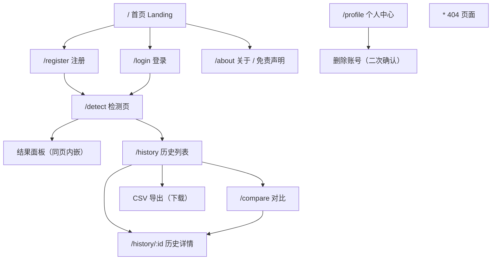
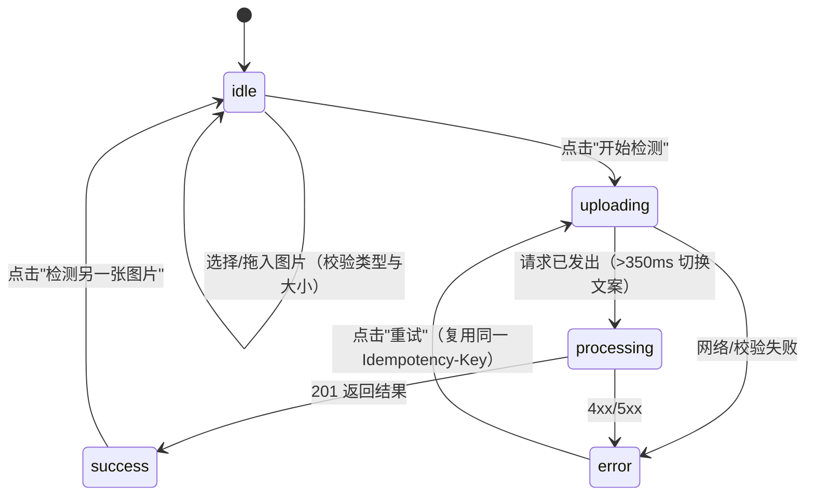

# UI / UX 设计文档

- 技术栈：React 18 + TypeScript + TailwindCSS 3 + React Router 6
- 设计目标：专业、医疗科技感、简洁、可信、响应式
- 设计原则：**信息优先级 > 视觉装饰**；任何页面都不允许出现"确诊/保证/100% 安全/无需就医"等误导性表达

---

## 1. 信息架构与页面清单

| 页面 | 路由 | 是否需要登录 | 主要任务 |
| --- | --- | --- | --- |
| 首页 | `/` | 否 | 了解系统能力与免责声明，进入注册/登录/检测 |
| 注册 | `/register` | 否 | 创建账号并自动登录 |
| 登录 | `/login` | 否 | 登录 |
| 检测 | `/detect` | 是 | 上传图片 → 触发检测 → 查看结果 |
| 历史列表 | `/history` | 是 | 浏览、筛选、分页、勾选对比、导出 CSV |
| 历史详情 | `/history/:id` | 是 | 查看某次检测的图片与结果，可删除 |
| 对比 | `/compare` | 是 | 并排比较两条记录 |
| 个人中心 | `/profile` | 是 | 修改昵称/用户名，查看模型信息，删除账号 |
| 关于/免责声明 | `/about` | 否 | 算法说明、隐私说明、系统状态 |
| 404 | `*` | 否 | 引导返回首页 |

## 2. 关键流程

### 2.1 检测主流程（状态机）

UI 行为约束：

- `uploading`/`processing` 期间禁用上传区、选择按钮、检测按钮（`aria-busy`）；
- 按钮内显示旋转指示器与"上传中…/模型推理中…"文案，防止重复点击；
- 同一张图片的重复点击复用同一个 `Idempotency-Key`，不会产生重复历史记录；
- 更换图片时生成新的幂等键。

### 2.2 上传交互细节

| 场景 | 表现 |
| --- | --- |
| 拖拽进入 | 边框变 `brand-500`、背景变 `brand-50`（同时保留文字提示，不仅靠颜色） |
| 类型不支持 | 红色提示"仅支持 JPG / PNG / WEBP / BMP 格式的图片" |
| 文件过大 | 红色提示"图片大小不能超过 10 MB（当前 xx MB）" |
| 空文件 | 红色提示"文件为空，请重新选择" |
| 已选图片 | 显示预览图 + 文件名/大小/类型 + "更换图片"/"移除图片" |
| 服务端拒绝 | 服务端错误消息直接展示在检测区（`role="alert"`） |

## 3. 组件清单

| 组件 | 文件 | 职责 |
| --- | --- | --- |
| `Layout` | `components/Layout.tsx` | 顶栏导航（响应式折叠）、页脚免责声明、Toast 容器 |
| `ImageUploader` | `components/ImageUploader.tsx` | 拖拽/点击上传、本地校验、预览、更换/移除 |
| `ResultCard` | `components/ResultCard.tsx` | 预测倾向、置信度、两类概率条、健康建议、免责声明 |
| `HistoryItem` | `components/HistoryItem.tsx` | 历史条目卡片（移动端卡片 / 桌面端横向布局）、对比勾选 |
| `HistoryThumbnail` | `components/HistoryThumbnail.tsx` | 授权后拉取并解密缩略图，含失败占位 |
| `ConfirmDialog` | `components/ConfirmDialog.tsx` | 破坏性操作二次确认，Esc 关闭，焦点自动落位 |
| `States` | `components/States.tsx` | `LoadingPanel`（骨架屏）、`EmptyPanel`、`ErrorPanel` |
| `Disclaimer` | `components/Disclaimer.tsx` | 全量/紧凑两种医疗免责声明 |
| `ToastHost` | `components/ToastHost.tsx` | 轻量通知，`role="status"` + `aria-live` |

## 4. 视觉规范

### 4.1 色彩

| 用途 | 色值 | 说明 |
| --- | --- | --- |
| 主色 brand-600 | `#0f8489` | 医疗青绿，按钮、链接、焦点环 |
| 良性 low | `#0f766e` / 背景 `#ecfdf5` | 良性倾向 |
| 恶性 high | `#b91c1c` / 背景 `#fef2f2` | 恶性倾向 |
| 中性 | slate 50–900 | 文本与边框 |

**颜色不是唯一的信息载体**：良/恶性同时使用文字（"良性倾向/恶性倾向"）、英文（Benign/Malignant）
和符号（✓ / ⚠），满足色觉障碍用户需求。

### 4.2 排版与间距

- 字体栈：`system-ui, -apple-system, "Segoe UI", "Noto Sans SC", "Microsoft YaHei"`；
- 正文 14px（`text-sm`），标题 20–36px；行高宽松（`leading-relaxed`）；
- 卡片圆角 `rounded-2xl`，阴影 `shadow-card`，内边距 16–24px；
- 交互元素最小高度 40px（移动端可触控）。

### 4.3 响应式断点

| 断点 | 布局 |
| --- | --- |
| `< 640px` | 单栏；导航折叠为"菜单"按钮；历史条目纵向卡片；结果与图片上下排列 |
| `640–1024px` | 两栏网格（上传 + 结果）；功能卡片 2 列 |
| `≥ 1024px` | 检测页左右双栏；功能卡片 3 列；历史条目横向一行 |

移动端额外保证：图片 `max-w-full` 不溢出屏幕；长文件名 `break-all`；表格类信息转为定义列表。

## 5. 无障碍（a11y）

| 要求 | 实现 |
| --- | --- |
| 语义化 HTML | `header/nav/main/footer/section/article/aside/ol/ul/dl` 语义标签 |
| 表单标签 | 每个输入都有 `<label htmlFor>`；上传区使用真实 `<button>` |
| 键盘可达 | 所有交互元素可 Tab 到达；`ConfirmDialog` 支持 Esc；焦点环 3px 高对比 |
| 图片替代文本 | 预览图、历史缩略图、详情图均有描述性 `alt` |
| 状态可感知 | 错误 `role="alert"`、加载 `role="status"` + `aria-live`、概率条 `role="progressbar"` + `aria-valuenow` |
| 不依赖颜色 | 见 4.1 |
| 减弱动效 | `prefers-reduced-motion` 下动画时长降至 0.01ms |
| 对比度 | 正文与背景对比度 ≥ 4.5:1（slate-900 on white / white on brand-600） |

## 6. 错误与空状态

| 场景 | 组件 | 文案示例 |
| --- | --- | --- |
| 历史为空 | `EmptyPanel` | "还没有检测记录 / 上传第一张皮肤病变图片，检测结果会自动保存到这里。" |
| 加载中 | `LoadingPanel` | 骨架屏 + `sr-only` 文本"正在加载检测历史…" |
| 请求失败 | `ErrorPanel` | 显示后端 `error.message` + "重试"按钮 |
| 图片不可用 | 占位块 | "无图" / "该记录没有保存图片" |
| 未登录访问受保护页 | 重定向 | 跳转 `/login`，登录后回到原页面 |
| 404 | `NotFoundPage` | "页面不存在 / 返回首页" |

## 7. 文案规范

### 7.1 结果文案

| 预测 | 主文案 | 健康建议 |
| --- | --- | --- |
| 恶性 | 恶性倾向 (Malignant) | "模型检测结果倾向于恶性风险。该结果不能替代医生诊断，建议尽快由皮肤科专业人员进一步评估；若皮损出现快速增大、颜色改变、破溃或出血，请尽快就医。" |
| 良性 | 良性倾向 (Benign) | "模型检测结果倾向于良性，但 AI 检测不能完全排除风险。如皮损持续变化、出现不适或你仍有疑虑，建议咨询皮肤科医生。" |

### 7.2 强制出现的声明

- 结果面板内：`AI辅助检测结果，仅供参考，不构成医学诊断。 模型置信度并不等同于真实临床患病概率。`
- 页脚常驻：`本系统仅作为皮肤健康辅助自检工具，检测结果仅供参考，不能替代专业医生诊断。`
- 首页、检测页、关于页：完整免责声明卡片。

### 7.3 禁止用语

`确诊`、`保证`、`100% 安全`、`无需就医`、`你患有皮肤癌`、`一定`、`绝对`。
（前端测试 `ResultCard.test.tsx` 会自动断言这些词不出现在结果卡片中。）

## 8. 设计走查清单

- [x] 首页有明确的"AI 辅助、非诊断"定位与免责声明
- [x] 上传前可预览，可更换、可移除
- [x] 检测过程有 loading 与禁用态，不能重复提交
- [x] 结果页展示倾向 + 置信度 + 两类概率 + 建议 + 免责声明
- [x] 历史支持分页、筛选、空状态、骨架屏、错误重试
- [x] 详情页可看历史图片（授权后解密）
- [x] 对比页并排展示图片与结果
- [x] 破坏性操作有二次确认
- [x] 移动端单栏可用，图片不溢出
- [x] 键盘可完成注册 → 登录 → 检测 → 查看历史
